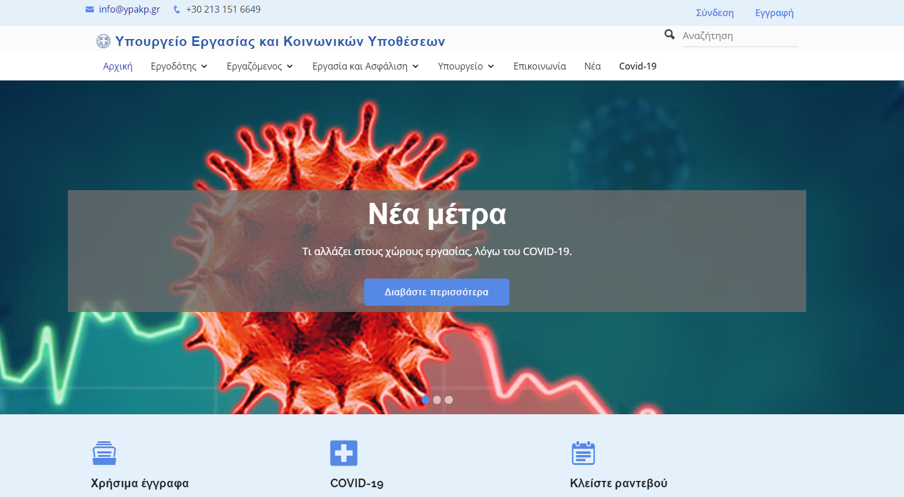
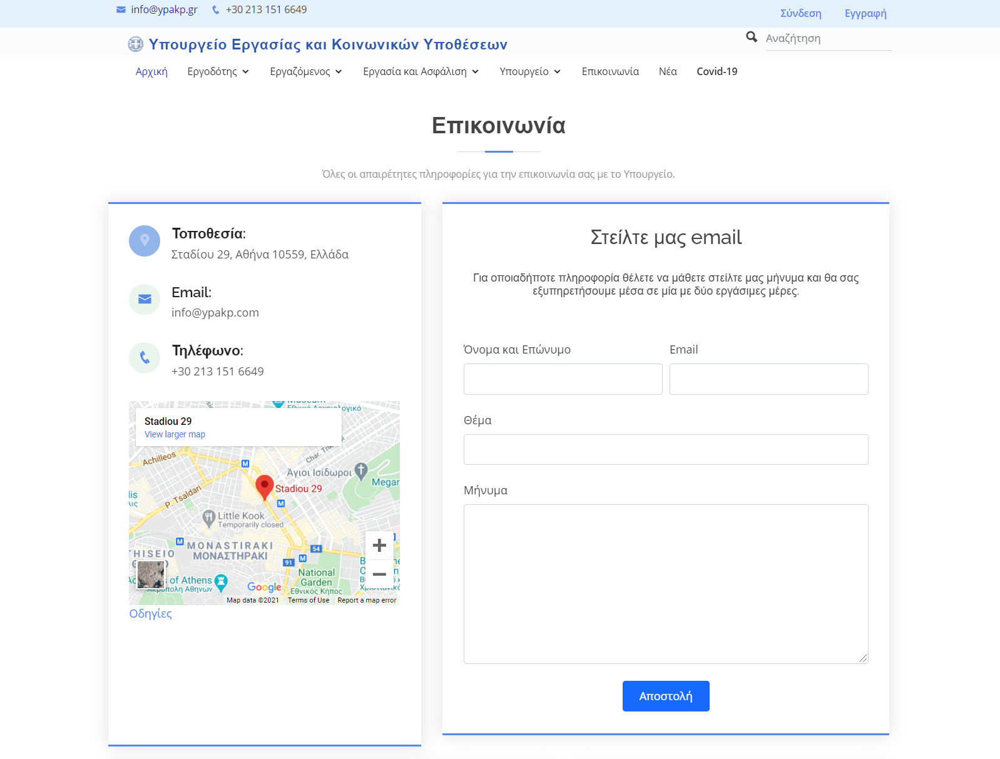
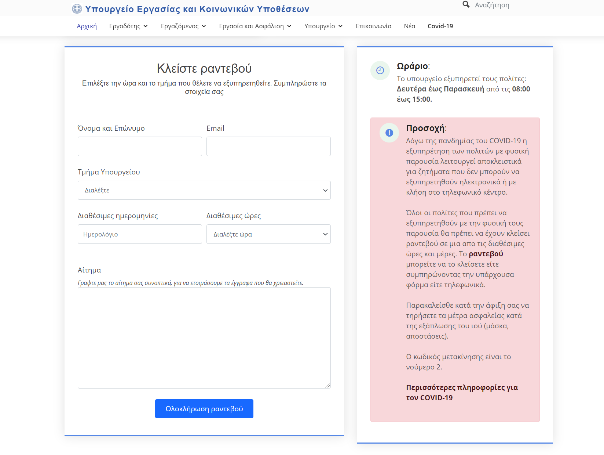
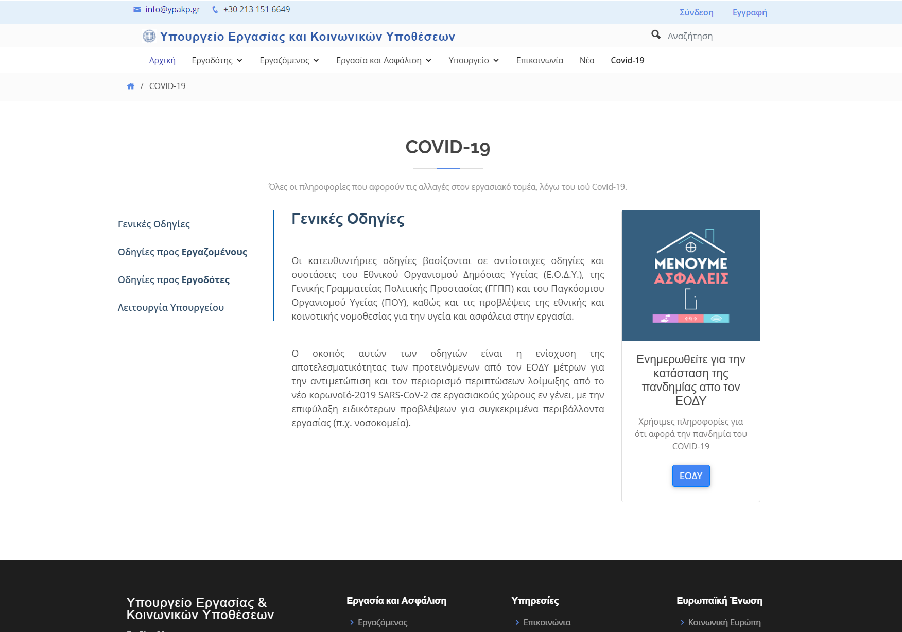
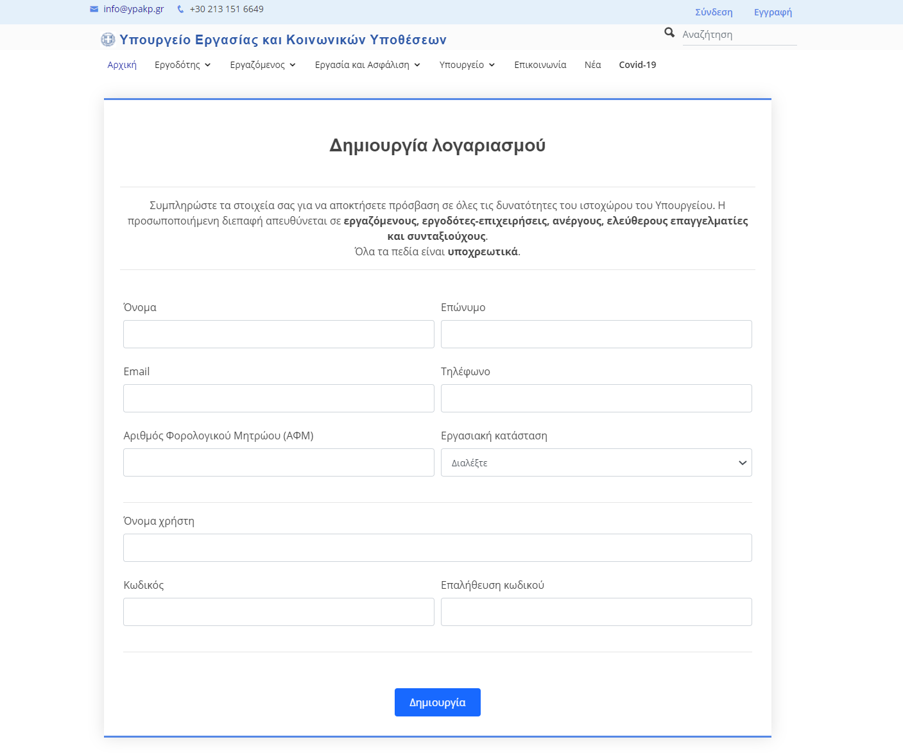
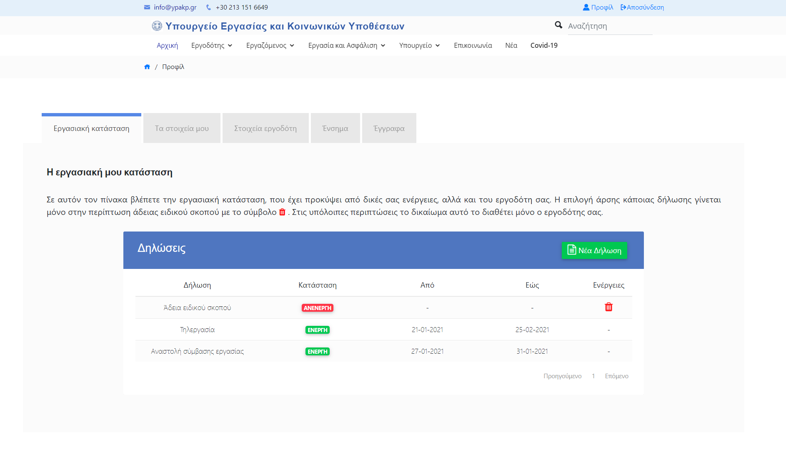
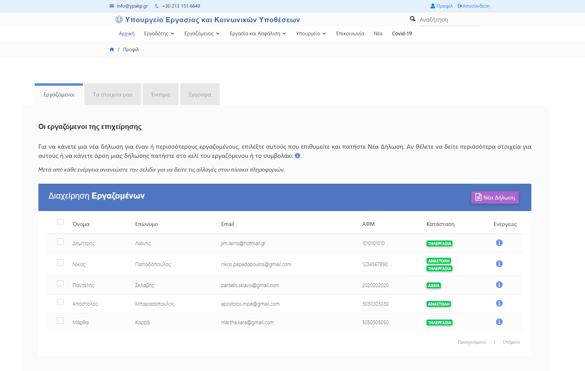
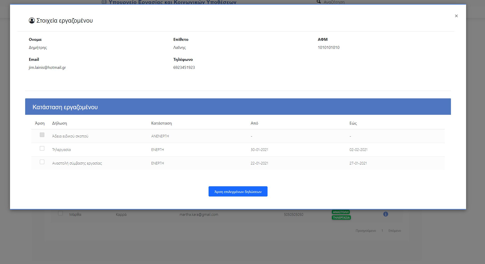
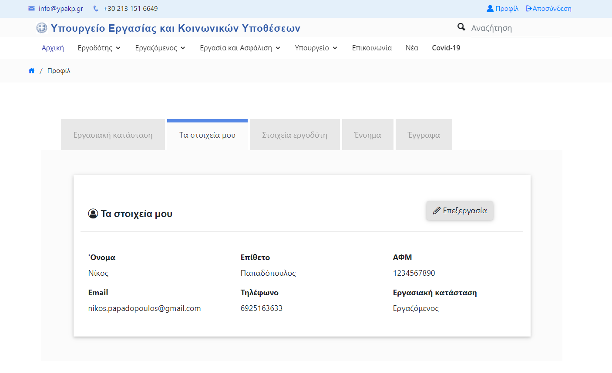

# Redesign the website of greek Ministry of Labour

Redesigning the website of greek Ministry of Labour, focusing on UX Design.
Made using PHP, SQL, HTML, CSS (Bootstrap) and JAVASCRIPT (Bootstrap, jQuery).

## Requested

* Implement the homepage of the website
* Implement the page of covid-19 informations
* Implement the page of contact information with the Ministry
* Implement certain forms for employees and employers
* Implement the page of personal info display and edit 

## Run site
1. Download xampp
2. Add this folder to \xampp\htdocs
3. Open xampp to your computer
4. Import the database from the folder (Name: database) to xampp
5. Start Apache and MySQL
6. Open to browser http://localhost/Greek_Ministry_of_Labour_site/

## Sign in 

Name of a user-employee: ΕΡΓΑΖΟΜΕΝΟΣ1  
Name of a user-employer: ΕΡΓOΔΟΤΗΣ1  
Password for both of them:12345  

## Screenshots of the website

### Homepage of the website

  

### Contact page

  

### Make an appointment 

  

### Covid19 page information

  

### Registration form

  

### Personal page of employee

  

### Personal page of employer

  

### When click on an employee, see information about him

  

### Page of personal info

  

